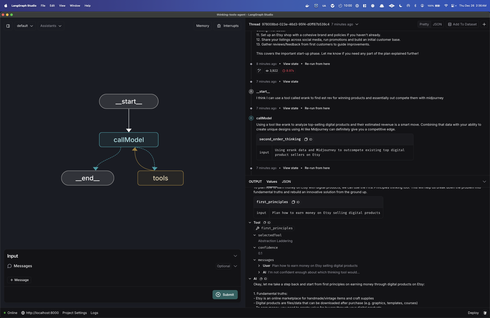
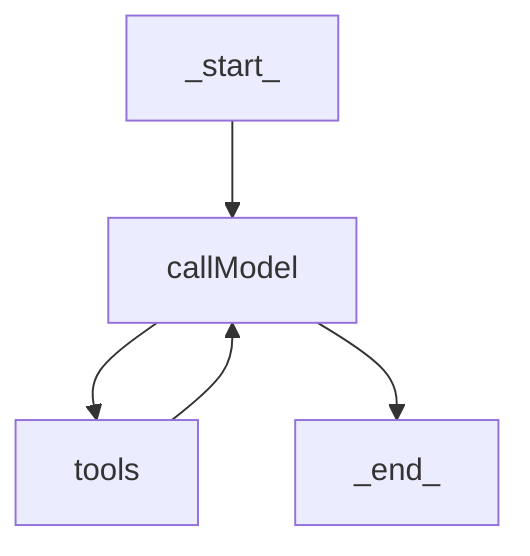

# Thinking Tools Guide

[](https://github.com/albeorla/thinking-tools-agent/actions)
[](coverage/lcov-report/index.html)

A LangGraph-based system that helps select the most appropriate thinking tool for your problem or decision-making needs. The system analyzes your query and recommends the best thinking tool based on the characteristics of your situation.

## Example Conversation

Here's an example showing how the thinking tools can help analyze a business opportunity:

**User**: Help me plan how to earn money on Etsy with digital products, we need to create a framework I can build on

**Assistant**: _Uses First Principles thinking to break down the problem:_

1. Fundamental truths:

- Etsy is an online marketplace for handmade/vintage items and craft supplies
- Digital products are files/data that can be downloaded after purchase
- To earn money, you need to create value for buyers

2. Framework:

- Research: Analyze trends, identify niches, study competitors
- Product Creation: Create professional digital products
- Marketing: Build brand, implement SEO, gather reviews
- Customer Service: Provide support and gather feedback

**User**: I think I can use erank to find estimated revenue for winning products and essentially outcompete them with Midjourney

**Assistant**: _Uses Second-Order Thinking to analyze implications:_

Advantages:

- Erank provides insights into profitable niches
- Midjourney enables efficient creation of unique designs
- Potential for competitive pricing while maintaining margins

Risks/Considerations:

- Market saturation challenges
- Ethical considerations around AI-generated art
- Quality control requirements
- Competition may adopt similar tools
- Customer support complexity

Second-Order Effects:

- Potential market disruption
- Impact on pricing and margins
- Evolving customer expectations
- Need for continuous adaptation

## Table of Contents

- [Thinking Tools Guide](#thinking-tools-guide)
  - [Example Conversation](#example-conversation)
  - [Table of Contents](#table-of-contents)
  - [Features](#features)
  - [Available Tools](#available-tools)
  - [Project Structure](#project-structure)
  - [Getting Started](#getting-started)
    - [Prerequisites](#prerequisites)
    - [Installation](#installation)
    - [Usage](#usage)
    - [Environment Variables](#environment-variables)
      - [Core LLM API Keys](#core-llm-api-keys)
      - [Environment Settings](#environment-settings)
      - [LangSmith Configuration](#langsmith-configuration)
  - [Development](#development)
    - [Code Organization](#code-organization)
    - [Commit Messages](#commit-messages)
    - [Adding New Tools](#adding-new-tools)
  - [Testing](#testing)
  - [Architecture](#architecture)
    - [Core Components](#core-components)
    - [System Flow](#system-flow)
  - [Built With](#built-with)
  - [Related Work](#related-work)
  - [License](#license)

## Features

- **Characteristic Analysis**: Identifies key characteristics of your problem or decision-making situation
- **Tool Selection**: Matches situation characteristics with the most appropriate thinking tool
- **Confidence Scoring**: Provides a confidence score for the recommendation
- **Natural Language Processing**: Understands various ways of expressing needs
- **Detailed Guidance**: Provides step-by-step process for applying the recommended tool

## Available Tools

1. **Abstraction Laddering**: For reframing problems at different levels
2. **OODA Loop**: For quick decision-making in competitive situations
3. **First Principles**: For breaking down complex problems
4. **Second-Order Thinking**: For considering long-term consequences
5. **Ladder of Inference**: For examining reasoning processes
6. **Minto Pyramid**: For structured communication
7. **Inversion**: For considering opposite perspectives

## Project Structure

```
.
├── src/
│   ├── core/           # Core business logic
│   │   ├── drivers/    # Tool selection and matching logic
│   │   └── types/      # Core type definitions
│   ├── data/           # Data definitions
│   │   └── tools/      # Thinking tool definitions
│   └── utils/          # Utility functions
├── test/               # Test files
│   ├── unit/          # Unit tests
│   ├── integration/   # Integration tests
│   └── fixtures/      # Test data and mocks
└── docs/              # Documentation
```

## Getting Started

### Prerequisites

- Node.js 16+ or Bun runtime
- OpenAI API key
- Anthropic API key (for Claude 3 Sonnet model)
- Tavily API key

### Installation

1. Clone the repository:

   ```bash
   git clone https://github.com/albeorla/thinking-tools-agent.git
   cd thinking-tools-agent
   ```

2. Install dependencies:

   ```bash
   bun install
   ```

3. Set up environment variables:
   - Copy `.env.example` to `.env`
   - Add your API keys and configuration:
     ```
     OPENAI_API_KEY=your_openai_key
     ANTHROPIC_API_KEY=your_anthropic_key
     TAVILY_API_KEY=your_tavily_key
     ```

### Usage

Run the example queries:

```bash
bun run src/index.ts
```

Or import and use in your own code:

```typescript
import { ThinkingToolDriver } from "@core/drivers/thinking-tool-driver";
import { thinkingTools } from "@data/tools/tool-definitions";

const driver = new ThinkingToolDriver(thinkingTools);

const result = await driver.process({
  messages: [
    {
      type: "user",
      content: "I need to make a quick decision with limited information",
    },
  ],
  confidence: 0,
});

console.log("Recommended Tool:", result.selectedTool);
```

### Environment Variables

The project uses environment variables for configuration. Copy `.env.example` to `.env` and configure:

#### Core LLM API Keys

- `OPENAI_API_KEY`: OpenAI API key for GPT models
- `ANTHROPIC_API_KEY`: Anthropic API key for Claude 3 Sonnet model
- `TAVILY_API_KEY`: Tavily API key for search functionality

#### Environment Settings

- `NODE_ENV`: Environment (development/production)

#### LangSmith Configuration

- `LANGCHAIN_PROJECT`: Project identifier for LangSmith
- `LANGSMITH_API_KEY`: API key for LangSmith integration

> **Important Note**: Never commit `.env` files containing real credentials. Use `.env.example` for documentation only.

## Development

### Code Organization

- `core/`: Contains the main business logic
  - `drivers/`: Tool selection and matching algorithms
  - `types/`: TypeScript type definitions
- `data/`: Data layer
  - `tools/`: Thinking tool definitions and characteristics
- `utils/`: Shared utilities and helper functions

### Commit Messages

This project uses conventional commits with AI-powered commit message generation. When you make a commit:

1. Stage your changes with `git add`
2. Run `git commit`
   - All checks (format, lint, tests) will run
   - If they pass, an AI will analyze your changes and generate a conventional commit message
   - The commit will be created with the generated message
3. Or use `git commit -m "your message"` to provide your own message

### Adding New Tools

1. Define the tool in `src/data/tools/tool-definitions.ts`
2. Add corresponding test cases in `test/unit/tool-definitions.test.ts`
3. Update tool coverage tests in `test/unit/thinking-tool-matching.test.ts`

## Testing

Run the test suite:

```bash
# Run Bun tests
bun test

# Run Jest tests with coverage
bun run test:jest:coverage
```

The project includes:

- Unit tests for individual components
- Integration tests for the complete workflow
- Performance and stress tests
- Edge case handling tests
- Coverage reporting (via Jest)
  - HTML reports in `coverage/lcov-report/`
  - Cobertura XML in `coverage/cobertura-coverage.xml`
  - LCOV data in `coverage/lcov.info`

Current coverage thresholds:

- Statements: >90%
- Branches: >90%
- Functions: 100%
- Lines: >90%

## Architecture

### Core Components

1. **ThinkingToolDriver**

   - Main orchestrator for tool selection and execution
   - Implements confidence scoring and natural language processing
   - Handles message routing and tool execution

2. **Tool Definitions**

   - Structured data for each thinking tool
   - Includes characteristics, use cases, and confidence factors
   - Supports natural language matching

3. **Type System**
   - Strong TypeScript typing throughout
   - Clear interfaces for messages and state
   - Enum-based tool categorization

### System Flow

The system uses a LangGraph-based architecture to manage the flow of conversation and tool selection:



The graph shows the core components:

- `_start_`: Entry point for new queries
- `callModel`: Main LLM interaction node
- `tools`: Tool selection and execution
- `_end_`: Conversation completion

This flow enables dynamic tool selection and recursive thinking patterns when needed.

## Built With

- [LangChain](https://js.langchain.com/) - LLM framework
- [LangGraph](https://github.com/langchain-ai/langgraph-js) - Graph orchestration
- [OpenAI](https://openai.com/) - Language model
- [Bun](https://bun.sh) - JavaScript runtime

## Related Work

- [ReAct: Synergizing Reasoning and Acting in Language Models](https://arxiv.org/abs/2210.03629) - Original ReAct paper introducing the framework for reasoning and acting in language models. ReAct combines:
  - **Re**asoning: Breaking down complex problems into steps
  - **Act**ing: Taking concrete actions based on that reasoning

Our system implements ReAct principles through:

1. **Reasoning Phase**: The `callModel` node analyzes the user's query and reasons about which thinking tool is most appropriate
2. **Action Phase**: The `tools` node executes the selected thinking tool
3. **Observation**: Results are observed and fed back into the reasoning process if needed
4. **Iteration**: The system can loop through this process multiple times for complex problems

The LangGraph flow visualized above shows this ReAct pattern in action:



This implementation allows for:

- Dynamic tool selection based on context
- Recursive thinking patterns when needed
- Continuous refinement of solutions
- Integration of multiple thinking frameworks

The ReAct framework provides the theoretical foundation for how our system combines analytical thinking tools with practical action steps.

## License

This project is licensed under the MIT License - see the LICENSE file for details.
